# 🌍 FUSAR-GPT

### A SAR-Centric Vision-Language Foundation Model

**Accepted by CVPR 2026** [](https://arxiv.org/abs/2602.19190)

> FUSAR-GPT integrates SAR imagery, AlphaEarth features, and language through Token-wise Linear Modulation (TLM) and a two-stage supervised fine-tuning strategy.

---

## 🔥 News

- **[2026.10]** Released detection training and inference code, model weights, 12 SAR–AEF examples, and visualizations. [](https://huggingface.co/kkcyy/FUSAR-GPT)
- 🎉 **[2026.02]** FUSAR-GPT has been accepted to **CVPR 2026**.

---

## 🧠 Motivation

Although vision-language models have achieved remarkable success on optical imagery, SAR understanding remains challenging because of:

- The gap between optical pretraining and SAR backscatter characteristics.
- Limited high-quality SAR–language alignment data.
- Difficulties in spatial reasoning and target-level interpretation.

FUSAR-GPT addresses these challenges with geospatial feature priors and a two-stage training strategy that separates semantic alignment from task adaptation.

## 🏗️ Architecture Overview

<p align="center">
  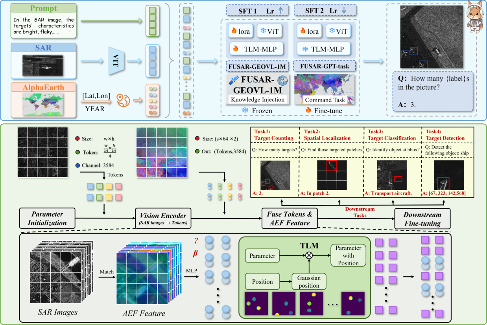
</p>

FUSAR-GPT builds on **Qwen2.5-VL-7B** and introduces **Token-wise Linear Modulation (TLM)** to incorporate 64-dimensional AlphaEarth features into SAR visual representations. The features and their image-local positions generate spatially varying modulation parameters for visual tokens.

### Stage 1: Large-Scene SAR Captioning Alignment

- Approximately 10k image–text–AEF triplets in the paper's alignment dataset.
- Descriptive supervision covering terrain, spatial layout, and target distribution.

### Stage 2: Target-Level Reasoning

- Approximately 2k annotated images selected for downstream training and evaluation in the paper.
- Task supervision for counting, localization, classification, and detection.

---

## 🖼️ Detection Examples

Ground truth is shown on the left (green), and predictions on the right (red). The 12 corresponding samples are provided in `examples/`.

<table>
  <tr>
    <td align="center" width="50%"><b>demo-01</b><br><a href="figures/predictions/demo-01.jpg">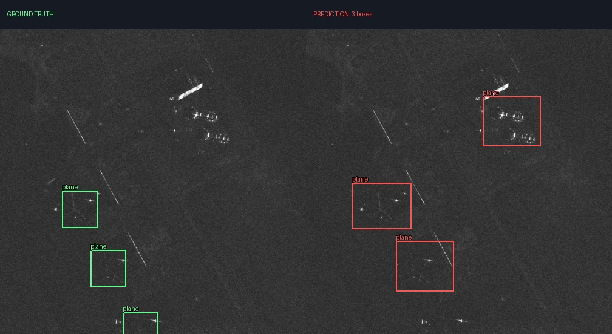</a></td>
    <td align="center" width="50%"><b>demo-02</b><br><a href="figures/predictions/demo-02.jpg">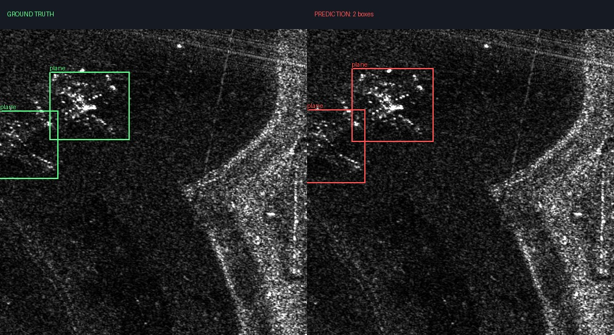</a></td>
  </tr>
  <tr>
    <td align="center" width="50%"><b>demo-03</b><br><a href="figures/predictions/demo-03.jpg">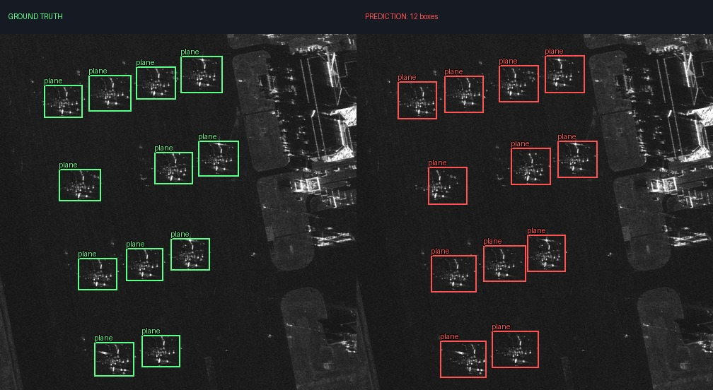</a></td>
    <td align="center" width="50%"><b>demo-04</b><br><a href="figures/predictions/demo-04.jpg">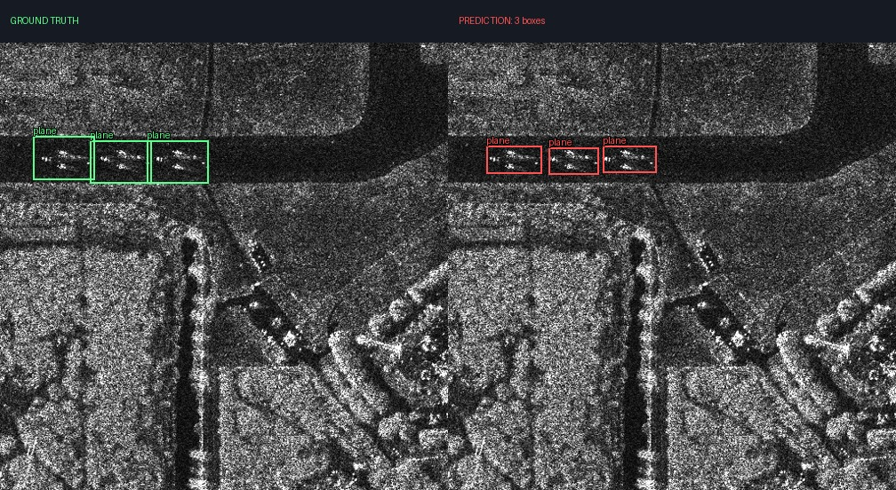</a></td>
  </tr>
  <tr>
    <td align="center" width="50%"><b>demo-05</b><br><a href="figures/predictions/demo-05.jpg">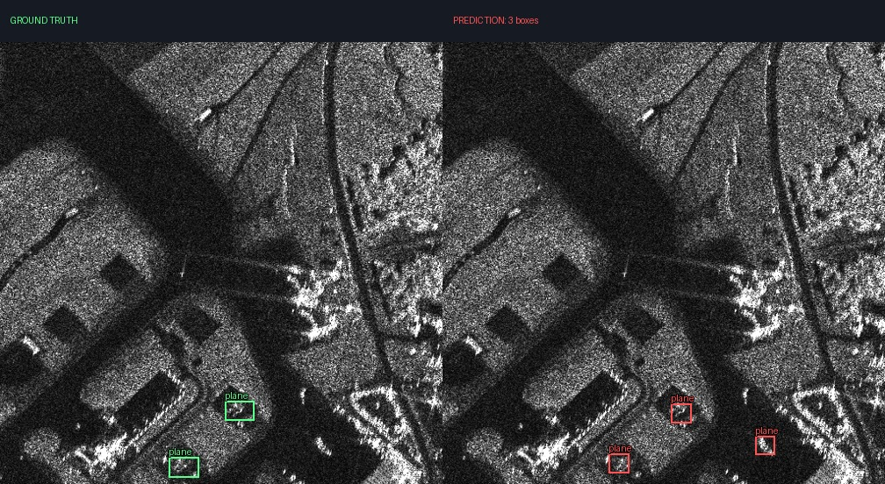</a></td>
    <td align="center" width="50%"><b>demo-06</b><br><a href="figures/predictions/demo-06.jpg">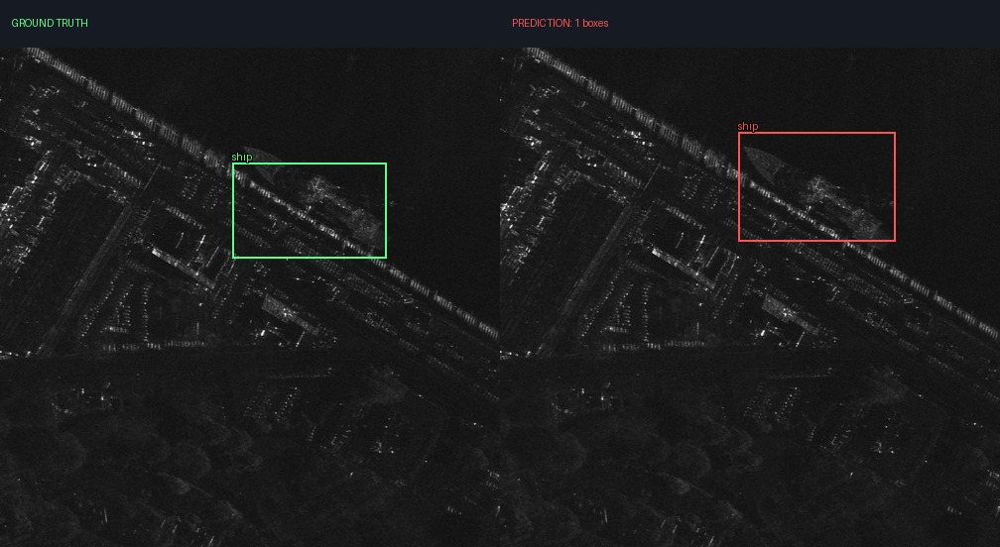</a></td>
  </tr>
  <tr>
    <td align="center" width="50%"><b>demo-07</b><br><a href="figures/predictions/demo-07.jpg">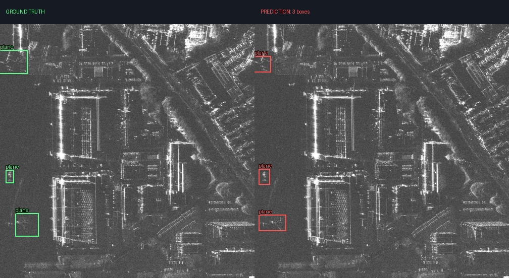</a></td>
    <td align="center" width="50%"><b>demo-08</b><br><a href="figures/predictions/demo-08.jpg">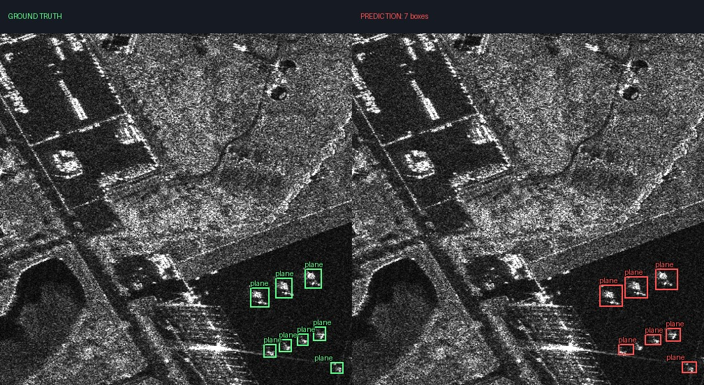</a></td>
  </tr>
  <tr>
    <td align="center" width="50%"><b>demo-09</b><br><a href="figures/predictions/demo-09.jpg">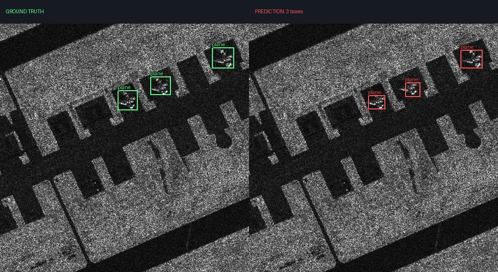</a></td>
    <td align="center" width="50%"><b>demo-10</b><br><a href="figures/predictions/demo-10.jpg">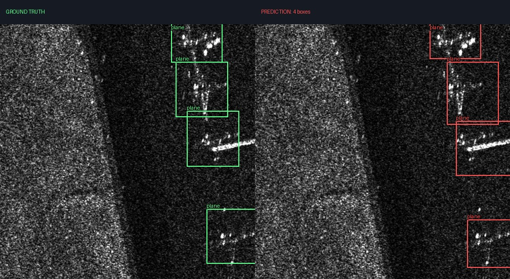</a></td>
  </tr>
  <tr>
    <td align="center" width="50%"><b>demo-11</b><br><a href="figures/predictions/demo-11.jpg">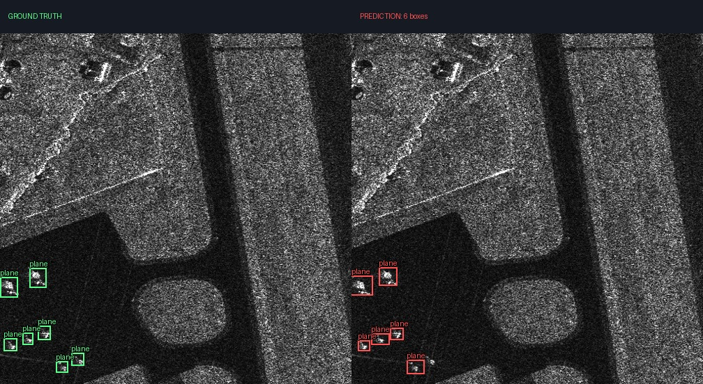</a></td>
    <td align="center" width="50%"><b>demo-12</b><br><a href="figures/predictions/demo-12.jpg">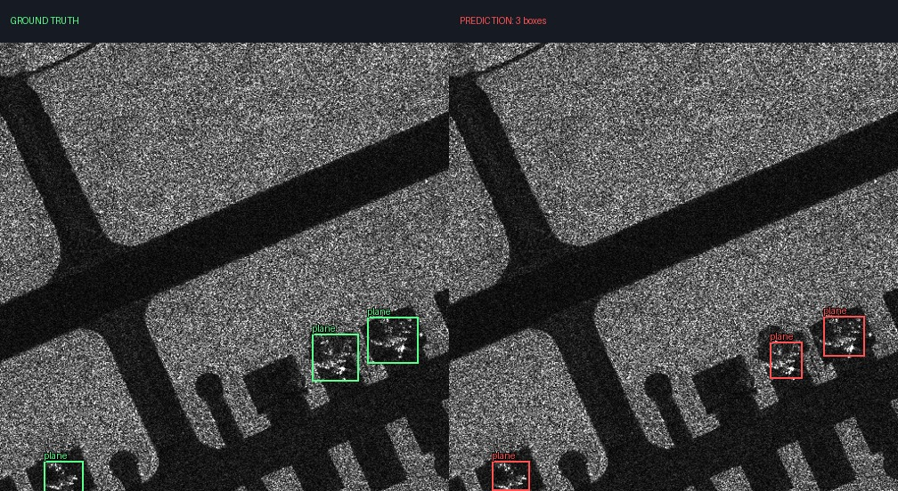</a></td>
  </tr>
</table>

## 📂 Data Availability

Due to data-sharing restrictions, we cannot release the complete experimental datasets. We provide 12 SAR images with AEF features and detection annotations for demonstration. Geographic coordinates, original geospatial filenames, and image metadata have been removed.

Bounding boxes use `xyxy` pixel coordinates on 504 × 504 images. Each AEF `.npz` file contains:

```text
features:  float32 [S, 64]
positions: float32 [S, 2]   # normalized image-local (y, x)
```

---

## 🚀 Getting Started

### Installation

```bash
pip install -r requirements.txt
```

### Model Files

Download the [Qwen2.5-VL-7B-Instruct](https://modelscope.cn/models/Qwen/Qwen2.5-VL-7B-Instruct) backbone with ModelScope:

```bash
modelscope download --model Qwen/Qwen2.5-VL-7B-Instruct --local_dir ./models/Qwen2.5-VL-7B-Instruct
```

If the backbone is already available locally, use its path below.

Download the [detection weights](https://huggingface.co/kkcyy/FUSAR-GPT/tree/main/stage2/detection) into `checkpoints/stage2/detection/`:

```bash
hf download kkcyy/FUSAR-GPT --include "stage2/detection/*" --local-dir ./checkpoints
```


Directory layout:

```text
FUSAR-GPT/
├── train_tlm.py
├── infer_val.py
├── train_no_aef.py
├── infer_no_aef.py
├── data_no_aef.py
├── lora_utils.py
├── tlm.py
├── data.py
├── requirements.txt
├── examples/
│   ├── detection.jsonl
│   ├── detection_no_aef.jsonl
│   └── assets/                 # 12 PNG images and 12 AEF NPZ files
├── figures/
└── checkpoints/stage2/detection/
    ├── adapter_config.json
    ├── adapter_model.safetensors
    ├── vec64_film.pt
    └── ...                     # processor/tokenizer files
```

### Detection Inference

For the existing checkpoint, run:

```bash
python infer_val.py \
  --base-model ./models/Qwen2.5-VL-7B-Instruct \
  --adapters-dir checkpoints/stage2/detection \
  --input-json examples/detection.jsonl \
  --legacy-sigma 2 \
  --save-pred-jsonl outputs/detection/predictions.jsonl \
  --overlay-dir outputs/detection/overlays
```

Outputs include:

- `predictions.jsonl`: model responses and parsed detections.
- `overlays/`: predicted bounding boxes drawn on the SAR images.

### Two-Stage Training

Prepare your training images, AEF features, and text annotations in the format of `examples/detection.jsonl`.


Stage 1:

```bash
torchrun --nproc_per_node=4 train_tlm.py \
  --base-model ./models/Qwen2.5-VL-7B-Instruct \
  --stage 1 \
  --train-json data/stage1_train.jsonl \
  --output-dir outputs/stage1 \
  --lora-rank 8 --lora-alpha 32 \
  --epochs 30 --lr 1e-4
```

Stage 2:

```bash
torchrun --nproc_per_node=4 train_tlm.py \
  --base-model ./models/Qwen2.5-VL-7B-Instruct \
  --stage 2 \
  --train-json data/detection_train.jsonl \
  --init-adapter outputs/stage1 \
  --output-dir outputs/detection \
  --epochs 5 --lr 1e-5
```

To fine-tune the released Stage 1 weights, download them and use
`--init-adapter checkpoints/stage1 --legacy-sigma 2` in the Stage 2 command:

```bash
hf download kkcyy/FUSAR-GPT --include "stage1/*" --local-dir ./checkpoints
```

Stage 2 freezes TLM and trains the adapters present in the checkpoint. For single-GPU training, replace `torchrun --nproc_per_node=4` with `python`; add `--gradient-checkpointing` to reduce memory usage.

### Fine-tuning without AEF

Use SAR images and text without AEF files. Each JSONL record requires `image`, `question`, and `answer`; image paths are relative to the JSONL file. See `examples/detection_no_aef.jsonl` for the format. 

Download Stage 1 and continue fine-tuning:

```bash
hf download kkcyy/FUSAR-GPT --include "stage1/*" --local-dir ./checkpoints

torchrun --nproc_per_node=4 train_no_aef.py \
  --base-model ./models/Qwen2.5-VL-7B-Instruct \
  --init-adapter checkpoints/stage1 \
  --train-json data/detection_train.jsonl \
  --output-dir outputs/detection_no_aef \
  --epochs 5 --lr 1e-5
```

For single-GPU training, replace `torchrun --nproc_per_node=4` with `python`. Omit `--init-adapter` to start from the original Qwen model. 

Run inference and save detection visualizations:

```bash
python infer_no_aef.py \
  --base-model ./models/Qwen2.5-VL-7B-Instruct \
  --adapters-dir outputs/detection_no_aef \
  --input-json examples/detection_no_aef.jsonl \
  --save-pred-jsonl outputs/no_aef/predictions.jsonl \
  --overlay-dir outputs/no_aef/overlays
```

Both inference scripts can load Stage 1 with `--adapters-dir checkpoints/stage1`. Use `infer_val.py` with `--legacy-sigma 2` to load LoRA and TLM weights and use AEF features, or `infer_no_aef.py` to load only LoRA weights without AEF. For captioning or other text answers with `infer_no_aef.py`, add `--task text` and omit `--overlay-dir`. Inference can distribute the model across visible GPUs automatically.

---

## 📄 License

The code is released under the **MIT License**. 

## 🔗 Connection to FUSAR-KLIP

This work builds on our prior research, **FUSAR-KLIP**, a knowledge-guided multimodal framework for remote-sensing and SAR image interpretation.

[](https://arxiv.org/abs/2509.23927)
[](https://github.com/yangyifremad/FUSAR-KLIP)

---

## 📚 Citation

If you find our work useful in your research, please consider citing:

```bibtex
@misc{zhang2026fusargptspatiotemporalfeatureembedded,
  title={FUSAR-GPT: A Spatiotemporal Feature-Embedded and Two-Stage Decoupled Visual Language Model for SAR Imagery},
  author={Xiaokun Zhang and Yi Yang and Ziqi Ye and Baiyun and Xiaorong Guo and Qingchen Fang and Ruyi Zhang and Xinpeng Zhou and Haipeng Wang},
  year={2026},
  eprint={2602.19190},
  archivePrefix={arXiv},
  primaryClass={cs.CV},
  url={https://arxiv.org/abs/2602.19190}
}

@misc{yang2025fusarklipmultimodalfoundationmodels,
  title={FUSAR-KLIP: Towards Multimodal Foundation Models for Remote Sensing},
  author={Yi Yang and Xiaokun Zhang and Qingchen Fang and Jing Liu and Ziqi Ye and Rui Li and Li Liu and Haipeng Wang},
  year={2025},
  eprint={2509.23927},
  archivePrefix={arXiv},
  primaryClass={cs.CV},
  url={https://arxiv.org/abs/2509.23927}
}
```

## Acknowledgments

We thank the Qwen team for [Qwen2.5-VL](https://modelscope.cn/models/Qwen/Qwen2.5-VL-7B-Instruct), Google and Google DeepMind for [AlphaEarth Foundations satellite embeddings](https://developers.google.com/earth-engine/datasets/catalog/GOOGLE_SATELLITE_EMBEDDING_V1_ANNUAL), and [ModelScope](https://github.com/modelscope/modelscope) for their open-source tools and resources. We also thank [Hugging Face](https://huggingface.co/) for hosting our model weights.
